# Formation Ansible - Exercices par Atelier

## Sommaire
- [Ansible par la pratique (3) – Installation](#atelier-01)
- [Ansible par la pratique (4) – Authentification](#atelier-03)
- [Ansible par la pratique (6) – Configuration de base](#atelier-06)
- [Ansible par la pratique (8) – Idempotence](#atelier-07)
- [Ansible par la pratique (10)– Un serveur web simple](#atelier-10)


## ATELIER-01

### Exercice 1: Installation d'Ansible depuis les dépôts officiels

#### Démarrage de la VM Ubuntu
```bash
cd ~/formation-ansible/atelier-01
vagrant up ubuntu
```

#### Connexion à la VM
```bash
vagrant ssh ubuntu
```

#### Rafraîchissement des paquets
```bash
sudo apt update
```

#### Recherche du paquet Ansible
```bash
apt-cache search --names-only ansible
```

#### Installation du paquet officiel
```bash
sudo apt install -y ansible
```

#### Vérification de l'installation et version d'Ansible
```bash
ansible --version
```

#### Déconnexion et suppression de la VM
```bash
exit
vagrant destroy -f ubuntu
```

---

### Exercice 2: Installation d'Ansible via un PPA

#### Démarrage et connexion à la VM Ubuntu
(Pareil que pour l'exercice 1)

#### Ajout du dépôt PPA Ansible
```bash
sudo apt-add-repository ppa:ansible/ansible -y
sudo apt update
```

#### Installation d'Ansible depuis le PPA
```bash
sudo apt install -y ansible
```

#### Vérification de la version installée
```bash
ansible --version
```

#### Comparaison des versions
Noter la version installée et la comparer avec celle de l'exercice précédent.

#### Déconnexion et suppression de la VM
```bash
exit
vagrant destroy -f ubuntu
```

---

### Exercice 3: Installation d'Ansible sur Rocky Linux via PIP et Virtualenv

#### Démarrage de la VM Rocky Linux
```bash
vagrant up rocky
```

#### Connexion à la VM
```bash
vagrant ssh rocky
```

#### Installation des prérequis
```bash
sudo dnf install -y python3 python3-pip
```

#### Création et activation d'un environnement virtuel
```bash
python3 -m venv ansible-venv
source ansible-venv/bin/activate
```

#### Installation d'Ansible via PIP
```bash
pip install --upgrade pip
pip install ansible
```

#### Vérification de l'installation et version d'Ansible
```bash
ansible --version
```

#### Désactivation de l'environnement virtuel
```bash
deactivate
```

#### Déconnexion et suppression de la VM
```bash
exit
vagrant destroy -f rocky
```

---

### Gestion des autres VMs

#### Démarrer une VM Debian
```bash
vagrant up debian
vagrant ssh debian
```

#### Démarrer une VM SUSE
```bash
vagrant up suse
vagrant ssh suse
```

#### Détruire une VM spécifique
```bash
vagrant destroy -f debian  
vagrant destroy -f suse    
```

---

## ATELIER-03

### Exercice : Configuration du Control Host et connexion aux Target Hosts

#### Accéder au répertoire de l'atelier 03
```bash
cd ~/formation-ansible/atelier-03
```

#### Démarrer les VM
```bash
vagrant up
```

#### Connexion au Control Host
```bash
vagrant ssh ansible
```

#### Vérifier la présence d'Ansible
```bash
type ansible
```

#### Configurer la résolution DNS locale
Éditer le fichier `/etc/hosts` sur le Control Host :
```bash
sudo vim /etc/hosts
```
Ajouter :
```
192.168.56.10      control 	      
192.168.56.20      target01
192.168.56.30      target02
192.168.56.40      target03
```

#### Collecter les clés SSH des Target Hosts
```bash
ssh-keyscan -t rsa target01 target02 target03 >> ~/.ssh/known_hosts
```

#### Tester la connectivité des Target Hosts
```bash
for HOST in target01 target02 target03; do ping -c 1 -q $HOST; done
```
#### On créer une paire de clef
```bash
ssh-keygen 
```

#### Je distribue la clé publique sur mes Target Hosts en fournissant à chaque fois le mot de passe vagrant :

```bash

ssh-copy-id vagrant@target01
ssh-copy-id vagrant@target02
ssh-copy-id vagrant@target03

```


#### Générer et distribuer la clé SSH
```bash
vagrant ssh ansible
ssh-keygen -t rsa -b 3072
ssh-copy-id vagrant@target01
ssh-copy-id vagrant@target02
ssh-copy-id vagrant@target03
```

#### Tester le ping 
```bash
ansible all -i target01,target02,target03 -m ping
```

#### Quitter le Control Host et supprimer les VM
```bash
exit
vagrant destroy -f
```

---
## ATELIER-06

### Ansible par la pratique (6) – Configuration de base

#### Démarrer les vm 
```bash
vagrant up 
```

#### Connectez-vous au Control Host :

```bash
vagrant ssh control
```

#### Éditez /etc/hosts de manière à ce que les Target Hosts soient joignables par leur nom d’hôte simple.

```bash
nano /etc/hosts
```

```bash
::1     ip6-localhost ip6-loopback
fe00::0 ip6-localnet
ff00::0 ip6-mcastprefix
ff02::1 ip6-allnodes
ff02::2 ip6-allrouters
127.0.2.1 control control

192.168.56.10 control
192.168.56.20 target01
192.168.56.30 target02
192.168.56.40 target03
``` 
### Générer une clé SSH (laisser les options par défaut)
```bash
ssh-keygen -t rsa -b 3072
```

### Copier la clé publique sur les Target Hosts
```bash
ssh-copy-id vagrant@target01
ssh-copy-id vagrant@target02
ssh-copy-id vagrant@target03
```
## 6. Installer Ansible
```bash
sudo apt update && sudo apt install -y ansible

vagrant@control:$ ansible --version | head -n 2
ansible 2.10.8
  config file = None
```
## 7. Envoyer un ping Ansible sans configuration
```bash
ansible all -i target01,target02,target03 -m ping
```
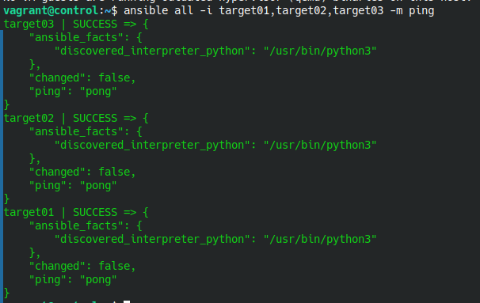


## 8. Créer un répertoire de projet
```bash
mkdir ~/monprojet
cd ~/monprojet
```

## 9. Créer un fichier de configuration Ansible
```bash
touch ansible.cfg

vagrant@control:~/monprojet$ ls 
ansible.cfg

```
## 10. Vérifier si `ansible.cfg` est bien pris en compte
```bash

vagrant@control:~/monprojet$ ANSIBLE_CONFIG=~/monprojet/ansible.cfg 
```

Résultas
```bash
ansible --version
ansible 2.10.8
  config file = /home/vagrant/monprojet/ansible.cfg
  configured module search path = ['/home/vagrant/.ansible/plugins/modules', '/usr/share/ansible/plugins/modules']
  ansible python module location = /usr/lib/python3/dist-packages/ansible
  executable location = /usr/bin/ansible
  python version = 3.10.12 (main, Mar 22 2024, 16:50:05) [GCC 11.4.0]
vagrant@control:~/monprojet$ 

```

## 11. Définir un inventaire
Créer un fichier `hosts` dans `monprojet` :
```bash
echo -e "[testlab]\ntarget01\ntarget02\ntarget03" > hosts
```
## 12. Activer la journalisation Ansible
Ajouter ceci à `ansible.cfg` :
```bash
echo -e "[defaults]\nlog_path = ~/journal/ansible.log" > ansible.cfg
```
## 13. Tester la journalisation
```bash
ansible all -i hosts -m ping
cat ~/journal/ansible.log
```
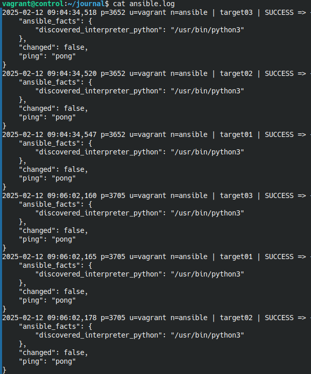

## 14. Définir explicitement l’utilisateur `vagrant`
Ajouter cette ligne au fichier `hosts` :
```bash
echo -e "[testlab:vars]\nansible_user=vagrant" >> hosts
```
## 15. Envoyer un ping Ansible vers le groupe `[all]`
```bash
ansible all -i hosts -m ping

```

J'ai pris un fail car mon fichier hosts était mal configuré, il manquait les hosts target : 
```txt
vagrant@control:~/journal$ cat ~/journal/hosts 
[testlab]
target01
target02
target03

[testlab:vars]
ansible_user=vagrant
vagrant@control:~/journal$ 
```
C'est mieux une fois édité : 
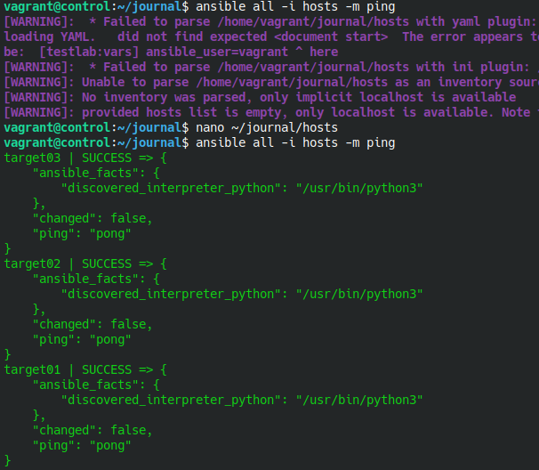

## 16. Définir l'élévation des droits pour `vagrant`
Ajouter à `hosts` :
```bash
echo "ansible_become=true" >> hosts
```


## 17. Afficher la première ligne du fichier `/etc/shadow` sur les Target Hosts
```bash
ansible all -i hosts -m command -a "head -n 1 /etc/shadow"
```
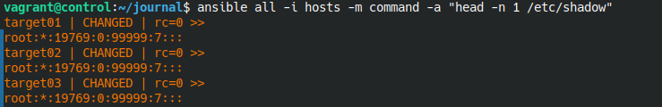


## 18. Quitter le Control Host
```bash
exit
```

## 19. Supprimer toutes les VM de l’atelier
```bash
vagrant destroy -f
```

## ATELIER-07 : Idempotence avec Ansible

## 1. Accéder au répertoire de l'atelier 07
```bash
cd ~/formation-ansible/atelier-07
```

## 2. Démarrer les machines virtuelles
```bash
vagrant up
```

## 3. Se connecter au Control Host
```bash
vagrant ssh ansible
```

## 4. Se placer dans le répertoire du projet Ansible
```bash
cd ansible/projets/ema/
ls
```
On voit bien que les fichiers ansible.cfg et inventory sont présents : 


## 5. Installation des paquets tree, git et nmap sur toutes les cibles
### Première et deuxeieme exécution
```bash
ansible all -m package -a "name=tree state=present"
ansible all -m package -a "name=git state=present"
ansible all -m package -a "name=nmap state=present"
```
### Deuxième exécution
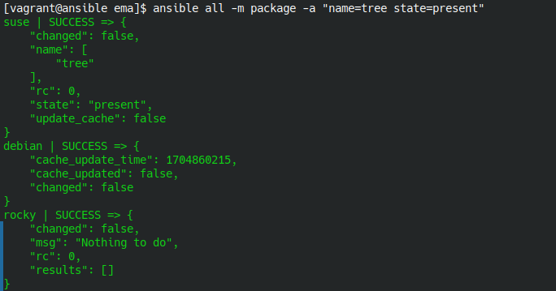
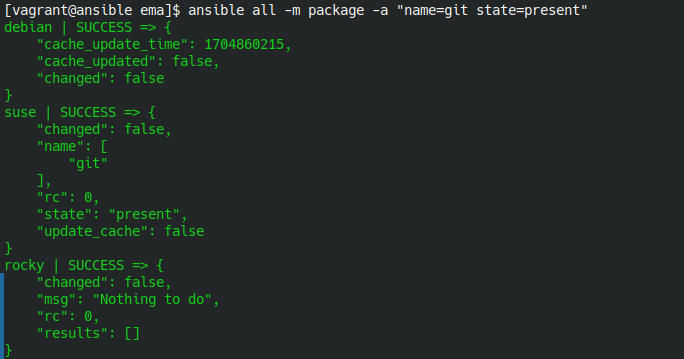
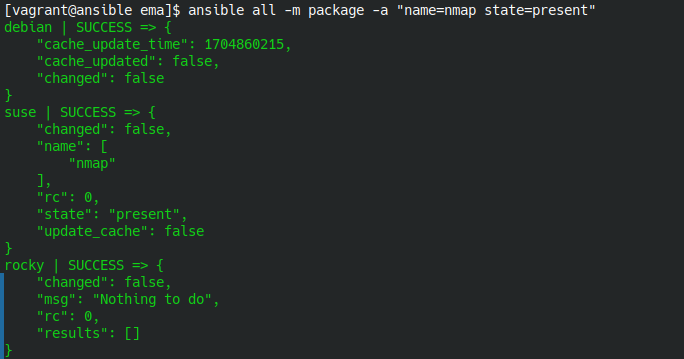

## 6. Désinstallation des paquets
### Première et deuxieme exécution
```bash
ansible all -m package -a "name=tree state=absent"
ansible all -m package -a "name=git state=absent"
ansible all -m package -a "name=nmap state=absent"
```
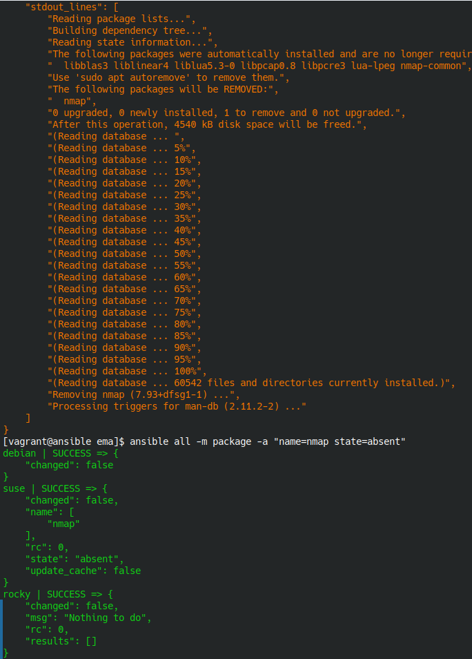

## 7. Copier le fichier `/etc/fstab` du Control Host vers les Target Hosts
### Première exécution
```bash
ansible all -m copy -a "src=/etc/fstab dest=/tmp/test3.txt mode=0644"
```
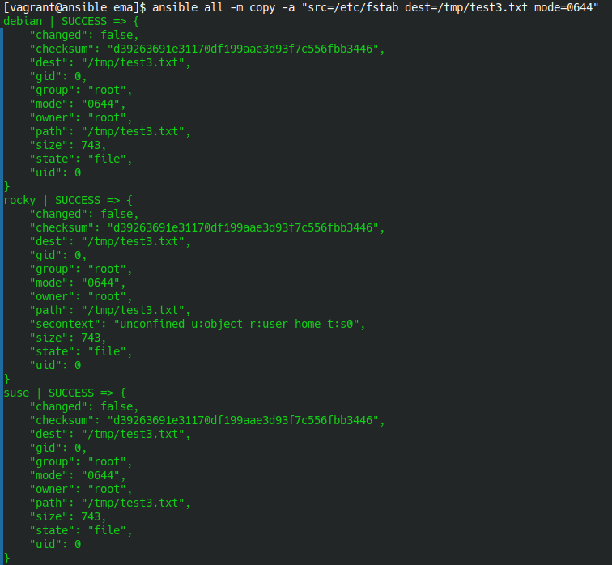


## 8. Supprimer le fichier `/tmp/test3.txt` sur les Target Hosts
### Première et duexieme exécution
```bash
ansible all -m file -a "path=/tmp/test3.txt state=absent"
```
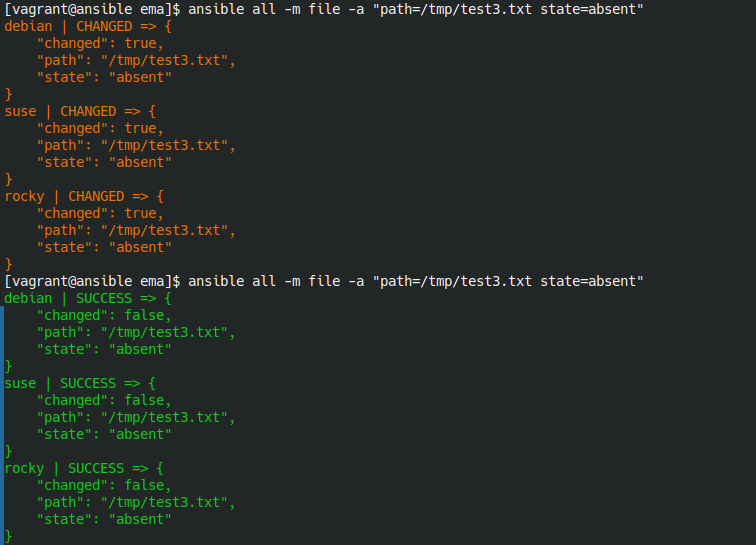

## 9. Vérifier l'espace utilisé sur la partition principale des Target Hosts
```bash
ansible all -m command -a "df -h /"
```

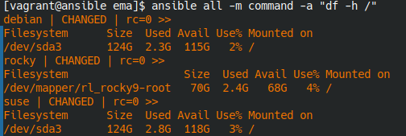

Ici on remarque que chaque exécution retourne exactement le même résultat pour chaque Target Host. Cela confirme que la commande n’altère pas l’état du système (elle est purement informative)

## 10. Quitter le Control Host
```bash
exit
```

## 11. Supprimer toutes les VM de l’atelier
```bash
vagrant destroy -f
```

# Atelier 10: Un serveur web simple

## Exercice 1 : 

1. **Démarrer les VMs**  
```bash
cd ~/formation-ansible/atelier-10
vagrant up
```

2. **Connexion au Control Host**
```bash
vagrant ssh ansible
```

3. **Se rendre dans le repertoire du projet**
```bash
cd ansible/projets/ema/
```

4. **Créer un playbook `apache-debian.yml`**
```yml
---  # Apache sur l’hôte Debian
- hosts: debian
  tasks:
    - name: Mettre à jour les caches
      apt:
        update_cache: true
        cache_valid_time: 3600

    - name: Installer Apache sur Debian
      apt:
        name: apache2
        state: present

    - name: Démarrer et activer le service Apache sur Debian
      service:
        name: apache2
        state: started
        enabled: true

    - name: Déployer la page web sur Debian
      copy:
        dest: /var/www/html/index.html
        mode: 0644
        content: |
          <!doctype html>
          <html>
            <head>
              <meta charset="utf-8">
              <title>Debian Apache</title>
            </head>
            <body>
              <h1>Apache web server running on Debian Linux</h1>
            </body>
          </html>
```

5. **Vérifier la syntaxe du fichier `apache-debian.yml`**
```bash
yamllint apache-debian.yml
```
Aucune sortie, le fichier `apache-debian.yml` est correct

6. **Créer un playbook `apache-rocky.yml`**
```yml
---  # Apache sur l’hôte Rocky
- hosts: rocky
  tasks:
    - name: Installer Apache sur Rocky
      dnf:
        name: httpd
        state: present

    - name: Démarrer et activer le service Apache sur Rocky
      service:
        name: httpd
        state: started
        enabled: true

    - name: Déployer la page web sur Rocky
      copy:
        dest: /var/www/html/index.html
        mode: 0644
        content: |
          <!doctype html>
          <html>
            <head>
              <meta charset="utf-8">
              <title>Rocky Apache</title>
            </head>
            <body>
              <h1>Apache web server running on Rocky Linux</h1>
            </body>
          </html>
```

7. **Vérifier la syntaxe du fichier `apache-rocky.yml`**
```bash
yamllint apache-rocky.yml
```
Aucune sortie, le fichier `apache-rocky.yml` est correct

8. **Créer un playbook `apache-suse.yml`**
```yml
---  # Apache sur l’hôte SUSE
- hosts: suse
  tasks:
    - name: Installer Apache sur SUSE
      zypper:
        name: apache2
        state: present

    - name: Démarrer et activer le service Apache sur SUSE
      service:
        name: apache2
        state: started
        enabled: true

    - name: Déployer la page web sur SUSE
      copy:
        dest: /srv/www/htdocs/index.html
        mode: 0644
        content: |
          <!doctype html>
          <html>
            <head>
              <meta charset="utf-8">
              <title>SUSE Apache</title>
            </head>
            <body>
              <h1>Apache web server running on SUSE Linux</h1>
            </body>
          </html>
```

9. **Vérifier la syntaxe du fichier `apache-suse.yml`**
```bash
yamllint apache-suse.yml
```
Aucune sortie, le fichier `apache-suse.yml` est correct

10. **Tester la connectivité**
```bash
ansible debian -m ping
debian | SUCCESS => {
    "changed": false,
    "ping": "pong"
}

ansible rocky -m ping
rocky | SUCCESS => {
    "changed": false,
    "ping": "pong"
}

ansible suse -m ping
suse | SUCCESS => {
    "changed": false,
    "ping": "pong"
}
```

11. **Exécuter le playbook `apache-debian.yml`**

```bash
ansible-playbook apache-debian.yml
```


12. **Exécuter le playbook `apache-rocky.yml`**

```bash
ansible-playbook apache-rocky.yml
```


13. **Exécuter le playbook `apache-suse.yml`**

```bash
ansible-playbook apache-suse.yml
```


14. **Vérifier les résultats**
```
curl debian
curl rocky
curl suse
```

